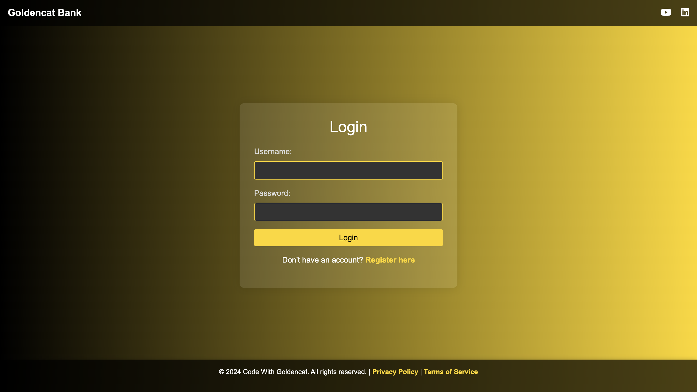
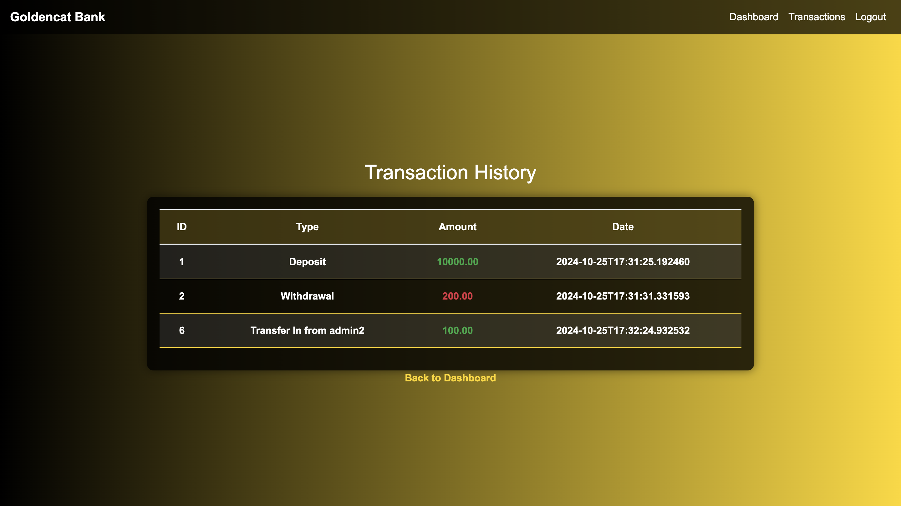

# Banking Application

- **Architecture**: The application uses a 2-tier architecture with a `frontend` built in *Java (Spring Boot)* and a `backend` using *MySQL Service*.

- **Database**: It is powered by MySQL for handling database transactions, user data, and managing information.

- **User Interface**: The application features a user-friendly interface built with Spring Boot, providing sections for login, registration, withdrawals, transaction history, and deposits.

> 

> 

## Banking Application Deployment - DevOps Practices

**Tech Stack**

- Docker
- Kubernetes
- Kubernetes Dashboard
- ArgoCD
- Jenkins
- SonarQube
- Git, GitHub
- Terraform

### Step 1 - Creating an EC2 Instance

We use Terraform to provision our EC2 instance:

```bash
# Navigate to the terraform directory
cd terraform

# Initialize Terraform
terraform init

# Preview changes
terraform plan

# Apply the configuration
terraform apply -auto-approve
```

The Terraform configuration creates:
- A t2.micro EC2 instance in us-west-2 region
- Security group with ports 22, 80, and 8080 open
- Bootstrap script that installs Docker, Jenkins, and kubectl

> Go to the `Terrafrom` Directory for more Information

# Required Installation

SSH into the EC2 Instance:

```bash
# Make Script Executable
chmod +x bootstrap.sh

# Run the script
sudo ./bootstrap.sh
```

It will install Docker and Jenkins in your system

### Configure Jenkins - CI/CD Pipelines

1. Access Jenkins at `http://<public_ip>:8080` and complete initial setup

2. Install required plugins:
   - Docker
   - Pipeline
   - Git
   - SonarQube Scanner

3. Add credentials:
   ```
   Dashboard > Manage Jenkins > Credentials > System > Global credentials
   ```
   - Add `dockerHubCredentials`: Docker Hub username/password
   - Add `sonarQubeToken`: SonarQube API token

4. Create pipeline:
   ```
   Dashboard > New Item > Pipeline
   ```
   - Set GitHub repository URL
   - Set branch to `master`
   - Use `Jenkinsfile` from repository

5. Run pipeline to build and deploy the application

The pipeline will:
- Build the Spring Boot application
- Run SonarQube analysis
- Build Docker image
- Push to Docker Hub

### Integration of SonarQube with Jenkins

1. Run SonarQube using Docker:
   ```bash
   docker run -d --name sonarqube -p 9000:9000 sonarqube:lts
   ```

2. Access SonarQube at `http://<public_ip>:9000` (default credentials: admin/admin)

3. Generate a token in SonarQube:
   ```
   Administration > Security > Users > Generate Token
   ```

4. Configure SonarQube in Jenkins:
   ```
   Manage Jenkins > System > SonarQube servers
   ```
   - Add SonarQube installation
   - Set URL: `http://<public_ip>:9000`
   - Use token from credentials

5. Install SonarScanner tool:
   ```
   Manage Jenkins > Tools > SonarQube Scanner
   ```
   - Add SonarQube Scanner installation
   - Name it `sonarQubeScanner`

The pipeline's SonarQube analysis stage will now use this configuration to scan code and report quality metrics.


### Install ArgoCD for GitOps Workflow

1. Create the ArgoCD namespace:
   ```bash
   kubectl create namespace argocd
   ```

2. Install ArgoCD in the cluster:
   ```bash
   kubectl apply -n argocd -f https://raw.githubusercontent.com/argoproj/argo-cd/stable/manifests/install.yaml
   ```

3. Access the ArgoCD UI:
   ```bash
   # Port forward the ArgoCD server service
   kubectl port-forward svc/argocd-server -n argocd 8080:443
   ```

4. Retrieve the initial admin password:
   ```bash
   kubectl -n argocd get secret argocd-initial-admin-secret -o jsonpath="{.data.password}" | base64 -d
   ```

5. Access the ArgoCD UI at `https://localhost:8080` with:
   - Username: admin
   - Password: [password from step 4]

### Deploy Application Using ArgoCD

1. Create a Git repository containing your Kubernetes manifests (or use the existing `/k8s` directory)

2. Create an application in ArgoCD UI:
   - Click "New App"
   - Application Name: `bank-app`
   - Project: `default`
   - Sync Policy: `Automatic`
   - Repository URL: Your Git repository URL
   - Path: `k8s`
   - Cluster: `https://kubernetes.default.svc`
   - Namespace: `bank-app`

3. Click "Create" to deploy the application

4. ArgoCD will automatically:
   - Create namespace
   - Deploy MySQL StatefulSet and Service
   - Apply ConfigMaps and Secrets
   - Deploy the Bank Application

5. Access the application:
   ```bash
   # Get the NodePort service URL
   kubectl get svc app-service -n bank-app
   ```

6. Visit `http://<node-ip>:30080` to access the banking application

The application is now deployed and managed through GitOps. Any changes to Kubernetes manifests in the repository will be automatically synchronized by ArgoCD.

### Applying Kubernetes Dashboard - Monitoring

1. Deploy Kubernetes Dashboard:
   ```bash
   kubectl apply -f https://raw.githubusercontent.com/kubernetes/dashboard/v2.7.0/aio/deploy/recommended.yaml
   ```

2. Create a service account and ClusterRoleBinding for dashboard access:
   ```bash
   kubectl create serviceaccount dashboard-admin-sa
   kubectl create clusterrolebinding dashboard-admin-sa --clusterrole=cluster-admin --serviceaccount=default:dashboard-admin-sa
   ```

3. Get the token for dashboard login:
   ```bash
   kubectl create token dashboard-admin-sa
   ```

4. Start the Kubernetes proxy:
   ```bash
   kubectl proxy
   ```

5. Access the dashboard at:
   [http://localhost:8001/api/v1/namespaces/kubernetes-dashboard/services/https:kubernetes-dashboard:/proxy/](http://localhost:8001/api/v1/namespaces/kubernetes-dashboard/services/https:kubernetes-dashboard:/proxy/)

6. Use the token from step 3 to log in

The dashboard provides:
- Pod status and health monitoring
- Resource utilization metrics
- Deployment status
- Log access and troubleshooting

## Conclusion

This project demonstrates a complete DevOps workflow for deploying a Spring Boot banking application:
- Infrastructure as Code with Terraform
- CI/CD pipeline with Jenkins
- Code quality with SonarQube
- Containerization with Docker
- GitOps deployment with ArgoCD and Kubernetes
- Monitoring with Kubernetes Dashboard
