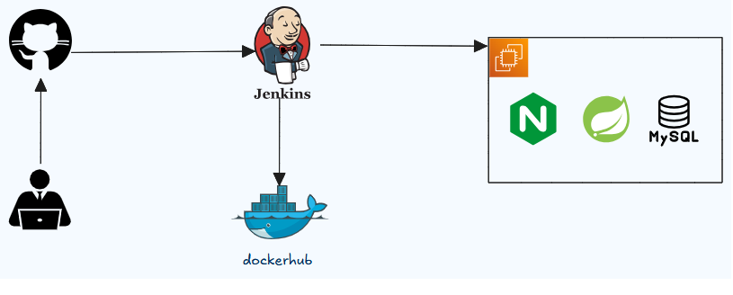
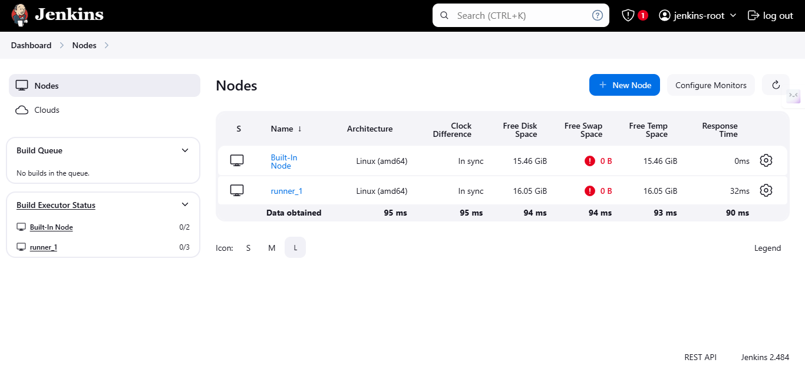
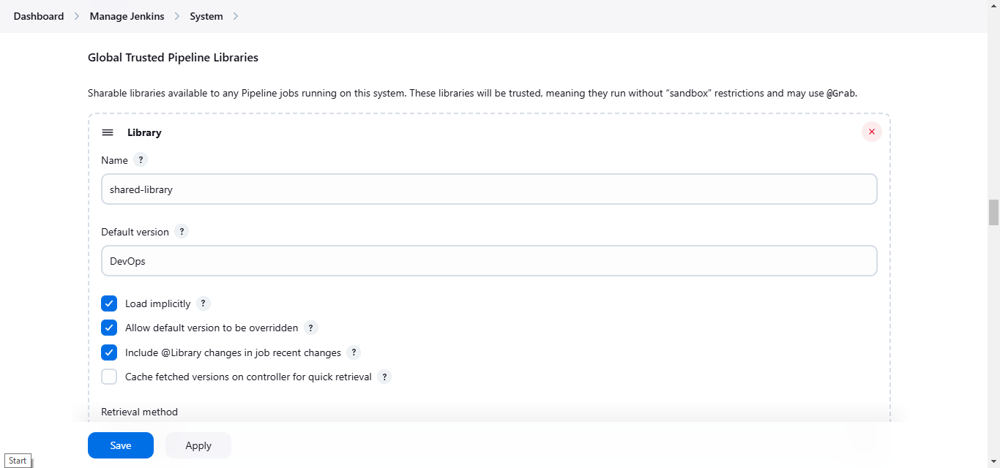
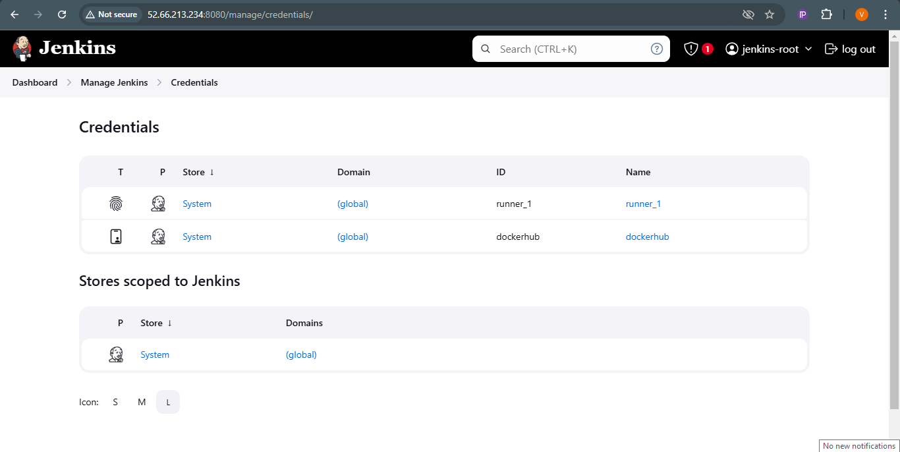

#### CICD Workflow
- Cloning the Project code from GitHub.
- Build docker image and push it to docker hub.
- Pull image from docker hub and deploy application using docker compose .

    
#### Creating CICD pipeline 

1. #### Install Jenkins and and acess on port 8080. Login and install Suggested Plugins.
    ```bash 
    http://<Instance_IP>:8080
    ```
2. #### Jenkins Configuration.
    - SetUp Agent
        - Agents are used for distribute the builds in parallel execution
        

        - Install Docker and docker-compose:V2 on worker node and add the user who is executing the Jenkins job into the docker group. because we are going to deploy application in worker node itself.

    - Configure Shared Library
        - Configure the task effectively in centralized manner.
        -  Configure shared library for your Jenkins Server Navigate through Dashboard > Manage Jenkins > System, and add Global Trusted Pipeline Libraries. (Modern SCM)

        


    - Configure Crendentials.
        - Credentials that are requied during job execution. 
        - e.g. DockerHub credentials for push and pull images.
        
        

3. #### Create a Pipeline, execute Job and Cofigure Weebhook..
    - Configure Pipeline.
        - Configure job to get pipeline from SCM.
        
    - Build Job and Check
        - Build the Job
    - Configure WebHook and poll SCM.
        - Webhook: Automatically built when a change is made to the Source code.
        - Poll: periodically monitor the repository and if any changes are detected, build Job.


#### Nginx and HTTPS [guide](nginx.md)
